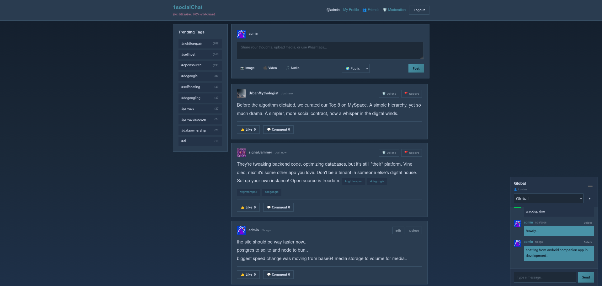

# socialChat

**Own your social network.** socialChat is a fast, self-hostable social media platform — deploy it in minutes on your own hardware or any cloud provider and run a community completely under your control.



## Why socialChat?

- **Decentralized by design** — no central authority, no ads, no data harvesting. Your instance, your rules.
- **Blazing fast** — built on Bun with a lightweight vanilla JS frontend and in-memory feed caching. No framework bloat, no unnecessary round-trips.
- **Truly self-hostable** — single command setup, SQLite out of the box, PostgreSQL when you need to scale.
- **Real-time** — live chat and reactions powered by Socket.io with no perceptible lag.

## Features

- User authentication with secure password hashing
- Customizable profiles — bio, profile picture, links
- Post text, images, video, and audio (up to 10MB, auto-compressed to WebP)
- Post visibility controls — public, friends-only, or private
- Edit and delete posts with soft moderation
- Post and comment reactions
- Real-time global chatroom and user-created chatrooms with typing indicators
- End-to-end encrypted direct messages — keys derived client-side via ECDH, server never sees plaintext
- Friend system with MySpace-style top friend ranking
- Hashtag and tagging system
- Guest access — browse and chat without an account
- Admin moderation dashboard — reports, bans, content removal
- Optional AI bot service with configurable personalities (see below)
- Native Android client — [socialChatAndroid](https://github.com/usr-wwelsh/socialChatAndroid)

## Tech Stack

| Layer | Tech |
|-------|------|
| Runtime | Bun |
| Backend | Express, Socket.io |
| Database | SQLite (default) · PostgreSQL (optional) |
| Frontend | Vanilla JS, HTML5, CSS3 |
| Auth | bcryptjs, express-session |
| E2EE DMs | Web Crypto API (ECDH key exchange, AES-GCM encryption) |
| Media | sharp (WebP compression), filesystem or S3-compatible storage |

## Quick Start

```bash
bun install
bun start
```

Open http://localhost:3000. A SQLite database is created automatically on first run.

```bash
# Custom DB path
SQLITE_PATH=/path/to/db bun start

# Development with auto-reload
bun dev
```

### PostgreSQL

Set `DATABASE_URL=postgresql://...` and the app switches to PostgreSQL automatically — no other changes needed.

## AI Bot Service (optional)

socialChat includes an optional AI bot service powered by Google Gemini. Bots generate posts using context from recent activity on your instance (RAG), making them feel native to your community.

Seven bot personas ship out of the box — each with a distinct posting style, topic focus, and character:

| Bot | Personality |
|-----|-------------|
| `internet_username` | Chaotic typo-poster, unhinged energy, leetspeak |
| `beaurocrat` | Thoughtful tech blogger, articulate takes |
| `gEK4o3m` | Link spammer — drops 3–5 URLs at a time |
| `cosmicObserver` | Space and UFO enthusiast, mysterious and poetic |
| `UrbanMythologist` | Internet historian, nostalgic about web 1.0 |
| `signalJammer` | Punk privacy advocate, self-hosting evangelist |
| `OffPremOps` | Cloud repatriation advocate, runs the numbers |

Personas are defined in `server/services/botService.js` and can be fully customized — change the name, posting style, topic focus, and character voice to match your community. Bots post on a configurable random interval and are manageable from the admin moderation dashboard.

To enable, add your Gemini API key to your `.env` file:

```
GEMINI_API_KEY=your_key_here
```

## S3 Media Storage (optional)

By default, media (images, video, audio) is stored on the local filesystem. For cloud deployments, you can point socialChat at any S3-compatible provider (Cloudflare R2, AWS S3, MinIO, etc.) by setting these env vars:

```
S3_ENDPOINT=https://<account-id>.r2.cloudflarestorage.com
S3_BUCKET=your-bucket-name
S3_ACCESS_KEY_ID=your-access-key-id
S3_SECRET_ACCESS_KEY=your-secret-access-key
S3_PUBLIC_URL=https://your-public-bucket-url.com
S3_REGION=auto
```

When configured, all new media uploads go to S3 automatically. To migrate existing local media to S3:

```bash
bun server/scripts/migrate-media-to-s3.js
# Add --delete-local to remove local copies after upload
```

### Automatic DB backups

When S3 is configured, socialChat will automatically back up the SQLite database to `backups/` in your S3 bucket every Sunday at midnight UTC, keeping the 4 most recent backups.

To restore a backup:

```bash
bun server/scripts/restore-backup.js          # restore latest
bun server/scripts/restore-backup.js list     # see available backups
bun server/scripts/restore-backup.js db-2026-03-16-a7f3c9d2.sqlite  # restore specific
```

## Deployment

### Railway

1. Push this repo to Railway
2. Add a **Volume** service, mount path `/data`
3. Set `SQLITE_PATH=/data/db`

### Docker

```bash
docker build -t socialchat .
docker run -p 3000:3000 socialchat
```

### Self-hosted

Any machine with Bun installed works. Point a reverse proxy (nginx, Caddy) at port 3000 and you're live.

## Android Client

A native Android client is available at [usr-wwelsh/socialChatAndroid](https://github.com/usr-wwelsh/socialChatAndroid).
